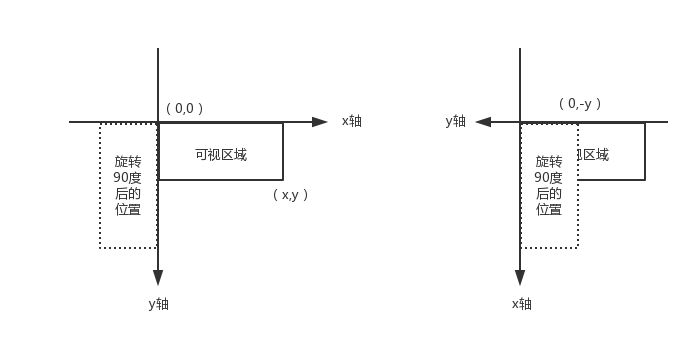

在手机上通过网页 input 标签拍照上传图片，有一些手机会出现图片旋转了90度d的问题，包括 iPhone 和个别三星手机。这些手机竖着拍的时候才会出现这种问题，横拍出来的照片就正常显示。因此，可以通过获取手机拍照角度来对照片进行旋转，从而解决这个问题。

## Orientation

这个参数并不是所有图片都有的，不过手机拍出来的图片是带有这个参数的。

参数为 1 的时候显示正常，那么在这些横拍显示正常，即 Orientation = 1 的手机上，竖拍的参数为 6。

想要获取 Orientation 参数，可以通过 exif.js 库来操作。exif.js 功能很多，体积也很大，未压缩之前足足有 30k，这对手机页面加载来说是非常大影响的。而我只需要获取 Orientation 信息而已，所以我这里删减了 exif.js 库的一些代码，将代码缩小到几KB。

exif.js 获取 Orientation ：

```js
EXIF.getData(file, function() {
  var Orientation = EXIF.getTag(this, 'Orientation');
});
```

file 则是 input 文件表单上传的文件。上传的文件经过 fileReader.readAsDataURL(file) 就可以实现预览图片了。

## 旋转

旋转需要用到 canvas 的 rotate() 方法。

```js
ctx.rotate(angle);
```

rotate 方法的参数为旋转弧度。需要将角度转为弧度：degrees * Math.PI / 180。

旋转的中心点默认都在 canvas 的起点，即 ( 0, 0 )。旋转的原理如下图：



旋转之后，如果从 ( 0, 0 ) 点进行 drawImage()，那么画出来的位置就是在左图中的旋转 90 度后的位置，不在可视区域呢。旋转之后，坐标轴也跟着旋转了，想要显示在可视区域呢，需要将 ( 0, 0 ) 点往 y 轴的反方向移 y 个单位，此时的起始点则为 ( 0, -y )。

同理，可以获得旋转 -90 度后的起始点为 ( -x, 0 )，旋转 180 度后的起始点为 ( -x, -y )。


## 压缩

手机拍出来的照片太大，而且使用 base64 编码的照片会比原照片大，那么上传的时候进行压缩就非常有必要的。现在的手机像素这么高，拍出来的照片宽高都有几千像素，用 canvas 来渲染这照片的速度会相对比较慢。

因此第一步需要先对上传照片的宽高做限制，判断宽度或高度是否超出哪个范围，则等比压缩其宽高。

```js
var ratio = width / height;
if (imgWidth > imgHeight && imgWidth > xx) {
  imgWidth = xx;
  imgHeight = Math.ceil(xx / ratio);
} else if (imgWidth < imgHeight && imgHeight > yy) {
  imgWidth = Math.ceil(yy * ratio);
  imgHeight = yy;
}
```

第二步就通过 canvas.toDataURL() 方法来压缩照片质量。

```js
canvas.toDataURL("image/jpeg", 1);
```

toDataURL() 方法返回一个包含图片展示的 data URI 。使用两个参数，第一个参数为图片格式，默认为 image/png。第二个参数为压缩质量，在指定图片格式为 image/jpeg 或 image/webp的情况下，可以从 0 到 1 的区间内选择图片的质量。

## 总结

```html
<input type="file" id="files" />


<script src="exif.js"></script>
<script>
var ipt = document.getElementById('files'),
    img = document.getElementById('preview'),
    Orientation = null;

ipt.onchange = function () {
  var file = ipt.files[0],
      reader = new FileReader(),
      image = new Image();

  if(file) {
    EXIF.getData(file, function() {
      Orientation = EXIF.getTag(this, 'Orientation');
    });

    reader.onload = function (ev) {
      image.src = ev.target.result;
      image.onload = function () {
        var imgWidth = this.width,
            imgHeight = this.height;

        // 控制上传图片的宽高
        if(imgWidth > imgHeight && imgWidth > 750){
          imgWidth = 750;
          imgHeight = Math.ceil(750 * this.height / this.width);
        }else if(imgWidth < imgHeight && imgHeight > 1334){
          imgWidth = Math.ceil(1334 * this.width / this.height);
          imgHeight = 1334;
        }

          var canvas = document.createElement("canvas"),
          ctx = canvas.getContext('2d');
          canvas.width = imgWidth;
          canvas.height = imgHeight;

          if(Orientation && Orientation != 1){
            switch(Orientation){
              case 6:     // 旋转90度
                canvas.width = imgHeight;
                canvas.height = imgWidth;
                ctx.rotate(Math.PI / 2);
                // (0,-imgHeight) 从旋转原理图那里获得的起始点
                ctx.drawImage(this, 0, -imgHeight, imgWidth, imgHeight);
                break;
              case 3:     // 旋转180度
                ctx.rotate(Math.PI);
                ctx.drawImage(this, -imgWidth, -imgHeight, imgWidth, imgHeight);
                break;
              case 8:     // 旋转-90度
                canvas.width = imgHeight;
                canvas.height = imgWidth;
                ctx.rotate(3 * Math.PI / 2);
                ctx.drawImage(this, -imgWidth, 0, imgWidth, imgHeight);
                break;
            }
          } else {
            ctx.drawImage(this, 0, 0, imgWidth, imgHeight);
          }
          img.src = canvas.toDataURL("image/jpeg", 0.8);
      }
    }
    reader.readAsDataURL(file);
  }
}
</script>
```
