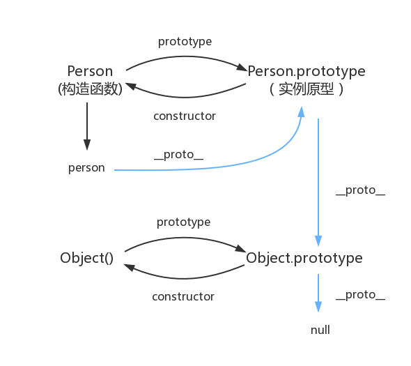

## 构造函数创建对象

首先使用构造函数创建一个对象:

```js
function Person() {};

var person = new Person();
person.name = 'yutiy';
console.log(person.name); // yutiy
```

在这个例子中，Person 就是一个构造函数，并使用 new 新建了一个实例对象 person。

## prototype

每个函数都有一个 prototype 属性，比如:

```js
function Person() {};

// prototype是函数才会有的属性
Person.prototype.name = 'yutiy';

var person1 = new Person();
console.log(person1.name);  // yutiy

var person2 = new Person();
console.log(person2.name);  // yutiy
```

那这个函数的 prototype 属性到底指向什么呢？是这个函数的原型吗？

其实函数的 prototype 属性指向了一个对象，这个对象正是调用该构造函数而创建**实例**的原型，也就是这个例子 person1 或 person2 的原型。

那什么是原型呢？可以这样理解: 每一个 Javascript 对象(null 除外)在创建的时候就会与之关联一个对象，这个对象就是所说的原型，每一个对象都会从原型中继承属性。

```bash
Person      ------------>    Person.prototype
(构造函数)     prototype          (实例原型)
```

构造函数和实例原型之间的关系如上，那实例和实例原型之间该怎么表示呢？这时候就要讲到第二个属性:

## __proto__

每一个 Javascript 对象(null 除外)都具有一个属性 __proto__, 这个属性会指向该对象的原型。

```js
function Person() {};

var person = new Person();
console.log(person.__proto__ === Person.prototype); // true
```

既然实例和构造函数都有属性指向实例原型，那么原型是否有属性指向构造函数或者实例呢?

## constructor

指向实例的是没有的，因为一个构造函数可以生成多个实例，但是原型指向构造函数的倒是有，这便是 constructor，每个原型都有一个 constructor 属性指向关联的构造函数。

```js
function Person() {};
console.log(Person.prototype.constructor === Person); // true
```

于是，关系图可以如下所述:


综上，我们可以得出如下:

```js
function Person(){}
var person = new Person();

console.log(person.__proto__ === Person.protoytpe); // true
console.log(Person.prototype.constructor === Person); // true

// 通过 ES5 方法获得对象原型
console.log(Object.getPrototypeOf(person) === Person.prototype); // true
```

## 实例与原型

当读取实例属性时，如果找不到，便会去与对象关联的原型属性上查找，如果还查不到，就去找原型的原型，一直到最顶层为止。举个栗子🌰:

```js
function Person() {};
Person.prototype.name = 'yutiy';

var person = new Person();
person.name = 'yl';
console.log(person.name); // yl

delete person.name;
console.log(person.name); // yutiy
```

打印 person.name 的时候，结果自然为 yl。但是当我们删除了 person 上的 name 属性时，就会从其原型 person.__proto__，也就是 Person.protptype 上查找，结果自然为 yutiy。

但是万一还是没找到呢？原型的原型又是什么呢？

## 原型的原型

前面讲到原型就是一个对象，既然是对象，就可以用最原始的方式创建它，就是:

```js
var obj = new Object();
obj.name = 'yutiy';
console.log(obj.name);  // yutiy
```

其实原型对象就是通过 Object 构造函数生成的，结合之前所讲，实例的 __proto__ 指向构造函数的 prototype，所以我们再更新下关系图:


## 原型链

那么 Object.prototype 的原型是什么呢？可以测试一下:

```js
console.log(Object.prototype.__proto__ === null); // true
```

可以看出，其为 null，`null 表示没有对象，即该处不应该有值`。所以当查到这里时就可以停止查找了，所以最后的关系图如下，其中蓝色线条就表示原型链:


## 补充

### constructor

首先是constructor，可以看个例子:

```js
function Person() {};
var person = new Person();

console.log(person.constructor === Person); // true
```

当读取person.constructor 时，其实 person 上并没有 constructor 属性，当不能读取到 constructor 属性时，会从 person 的原型也就是 Person.prototype 中读取，正好原型中有该属性，所以:

```js
person.constructor === Person.prototype.constructor;
```

### __proto__

绝大部分浏览器都支持这个非标准的方法访问原型，然而它并不存在于 Person.prototype 中，实际上，它是来自于 Object.prototype。
与其说是一个属性，不如说是一个 getter/setter，当使用 obj.__proto__ 时，可以理解成返回了 Object.getPrototypeOf(obj)。

### 真的是继承吗？

最后是关于继承，前面讲到 "每一个对象都会从原型 '继承' 属性"，实际上，继承是一个十分具有迷惑性的说法，引用《你不知道的JavaScript》中的话，就是：

继承意味着复制操作，然而 JavaScript 默认并不会复制对象的属性，相反，JavaScript 只是在两个对象之间创建一个关联，这样，一个对象就可以通过委托访问另一个对象的属性和函数，所以与其叫继承，委托的说法反而更准确些。

## 参考

[Javascript深入之从原型到原型链](https://github.com/mqyqingfeng/Blog/issues/2)
