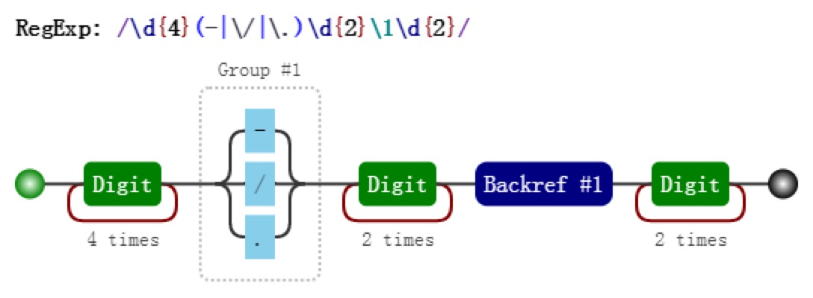

## 分组和分支结构

这二者是括号最直觉的作用，也是最原始的功能，强调括号内的正则是一个整体，即提供子表达式。

### 分组

括号提供分组功能，强调的是一个整体:

```js
var regex = /(ab)+/g;
var string = "ababa abbb ababab";

console.log( string.match(regex) );     // => ["abab", "ab", "ababab"]
```

### 分支结构

在多选分支结构中，括号也是必不可少的，其提供了分支表达式的所有可能:

```js
var str1 = 'I love JavaScript';
var str2 = 'I love Regular Expression';
var regex = /^I love (JavaScript|Regular Expression)$/;

console.log( regex.test(str1) );    // => true
console.log( regex.test(str2) );    // => true
```

如果去掉正则中的括号，则: `/^I love JavaScript|Regular Expression$/`, 则匹配的字符串是`I love JavaScript` 和 `Regular Expression`。

## 分组引用

分组引用的作用就是进行数据提取，以及更强大的替换的操作。以日期为例，假设格式是`yyyy-mm-dd`，我们可以先写一个简单的正则:

> var regex = /\d{4}-\d{2}-\d{2}/;

### 提取数据

比如提取出年、月、日，可以这么做：

```js
var regex = /(\d{4})-(\d{2})-(\d{2})/;
var string = "2017-06-12";
console.log( string.match(regex) ); // => ["2017-06-12", "2017", "06", "12", index: 0, input: "2017-06-12", groups: undefined]
```

> **match**返回的是一个数组，第一个元素是整体匹配结果，然后是各个分组（括号里）匹配的内容，然后是匹配下标，最后是输入的文本。正则表达式是否有修饰符 g，match返回的数组格式是不一样的。

同时，也可以使用构造函数的全局属性 `$1` 至 `$9` 来获取：

```js
var regex = /(\d{4})-(\d{2})-(\d{2})/;
var string = "2017-06-12";
regex.test(string);

// 正则操作即可，例如
// regex.exec(string); string.match(regex);
console.log(RegExp.$1); // "2017"
console.log(RegExp.$2); // "06"
console.log(RegExp.$3); // "12"
```

### 替换

比如，想把 yyyy-mm-dd 格式，替换成 mm/dd/yyyy 怎么做？

```js
var regex = /(\d{4})-(\d{2})-(\d{2})/;
var string = "2017-06-12";
var result = string.replace(regex, "$2/$3/$1");
console.log(result);  // => "06/12/2017"
```

其中 replace 中的，第二个参数里用 $1、$2、$3 指代相应的分组。等价于如下的形式：

```js
var regex = /(\d{4})-(\d{2})-(\d{2})/;
var string = "2017-06-12";
var result = string.replace(regex, function () {
  return RegExp.$2 + "/" + RegExp.$3 + "/" + RegExp.$1;
});
console.log(result);  // => "06/12/2017"

// 等价于
var result = string.replace(regex, function(match, year, month, day) {
  return month + "/" + day + "/" + year";
});
console.log(result);  // => "06/12/2017"
```

## 反向引用

正则本身里也是可以引用分组的，但只能引用之前出现的分组，即反向引用。

比如要写一个正则支持匹配如下三种格式 -> `2016-06-12、2016/06/12、2016.06.12`，可能最想想到的正则是:

```js
var regex = /\d{4}(-|\/|\.)\d{2}(-|\/|\.)\d{2}/;
var string1 = "2017-06-12";
var string2 = "2017/06/12";
var string3 = "2017.06.12";
var string4 = "2016-06/12";
console.log( regex.test(string1) ); // true
console.log( regex.test(string2) ); // true
console.log( regex.test(string3) ); // true
console.log( regex.test(string4) ); // true
```

其中 / 和 . 需要转义。虽然匹配了要求的情况，但也匹配 "2016-06/12" 这样的数据。

假设我们想要求分割符前后一致怎么办？此时需要使用反向引用：

```js
var regex = /\d{4}(-|\/|\.)\d{2}\1\d{2}/;
var string1 = "2017-06-12";
var string2 = "2017/06/12";
var string3 = "2017.06.12";
var string4 = "2016-06/12";
console.log( regex.test(string1) ); // true
console.log( regex.test(string2) ); // true
console.log( regex.test(string3) ); // true
console.log( regex.test(string4) ); // false
```

其可视化形式是:



### 括号嵌套怎么办？

以左括号（开括号）为准。比如：

```js
var regex = /^((\d)(\d(\d)))\1\2\3\4$/;
var string = "1231231233";
console.log( regex.test(string) ); // true
console.log( RegExp.$1 ); // 123
console.log( RegExp.$2 ); // 1
console.log( RegExp.$3 ); // 23
console.log( RegExp.$4 ); // 3
```

- 第一个字符是数字，比如说 "1"，
- 第二个字符是数字，比如说 "2"，
- 第三个字符是数字，比如说 "3"，
- 接下来的是 \1，是第一个分组内容，那么看第一个开括号对应的分组是什么，是 "123"，
- 接下来的是 \2，找到第2个开括号，对应的分组，匹配的内容是 "1"，
- 接下来的是 \3，找到第3个开括号，对应的分组，匹配的内容是 "23"，
- 最后的是 \4，找到第3个开括号，对应的分组，匹配的内容是 "3"。

### \10表示什么？

另外一个疑问可能是，即 \10 是表示第 10 个分组，还是 \1 和 0 呢？

```js
var regex = /(1)(2)(3)(4)(5)(6)(7)(8)(9)(#) \10+/;
var string = "123456789# ######"
console.log( regex.test(string) ); // => true
```

可见答案是前者，如果真要匹配 \1 和 0 的话，请使用 `(?:\1)0` 或者 `\1(?:0)`。

### 引用不存在的分组会怎样？

因为反向引用，是引用前面的分组，但我们在正则里引用了不存在的分组时，此时正则不会报错，只是匹配
反向引用的字符本身。例如 \2，就匹配 "\2"。注意 "\2" 表示对 "2" 进行了转义。

```js
var regex = /\1\2\3\4\5\6\7\8\9/;
console.log( regex.test("\1\2\3\4\5\6\7\8\9") );    // => true
// 浏览器打印出结果可能会不一样 => ["", "", "", "", "", "", "", "8", "9"]
console.log( "\1\2\3\4\5\6\7\8\9".split("") );
```

### 分组后面有量词会怎样？

分组后面有量词的话，分组最终捕获到的数据是最后一次的匹配。比如如下的测试案例:

```js
var regex = /(\d)+/;
var string = "12345";
console.log( string.match(regex) ); // => ["12345", "5", index: 0, input: "12345"]
```

从上面看出，分组 (\d) 捕获的数据是 "5"。同理对于反向引用，也是这样的。测试如下：

```js
var regex = /(\d)+ \1/;
console.log( regex.test("12345 1") ); // => false
console.log( regex.test("12345 5") ); // => true
```

## 非捕获括号

如果只想要括号最原始的功能，但不会引用它，即，既不在 API 里引用，也不在正则里反向引用。
此时可以使用非捕获括号 (?:p) 和 (?:p1|p2|p3)，例如本章第一个例子可以修改为：

```js
var regex = /(?:ab)+/g;
var string = "ababa abbb ababab";
console.log( string.match(regex) ); // => ["abab", "ab", "ababab"]
```

同理，第二例子可以修改为：

```js
var regex = /^I love (?:JavaScript|Regular Expression)$/;
console.log( regex.test("I love JavaScript") ); // => true
console.log( regex.test("I love Regular Expression") ); // => true
```

## 案例

### 将每个单词的首字母转换为大写

```js
function titleize (str) {
  // 不使用非捕获匹配也是可以的
  return str.toLowerCase().replace(/(?:^|\s)\w/g, function (c) {
    return c.toUpperCase();
  });
}

console.log( titleize('my name is epeli') ); // => "My Name Is Epeli"
```

### 匹配成对标签

```js
var regex = /<([^>]+)>[\d\D]*<\/\1>/;
var string1 = "<title>regular expression</title>";
var string2 = "<p>laoyao bye bye</p>";
var string3 = "<title>wrong!</p>";
console.log( regex.test(string1) ); // true
console.log( regex.test(string2) ); // true
console.log( regex.test(string3) ); // false
```

## 参考

[JavaScript 正则表达式迷你书](https://github.com/qdlaoyao/js-regex-mini-book)
