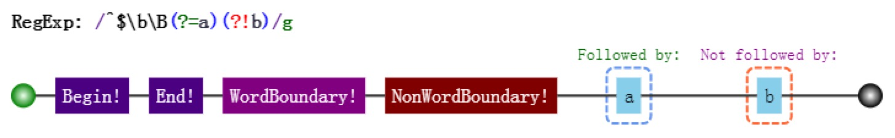

> 正则表达式是匹配模式，要么匹配字符，要么匹配位置。把位置理解空字符，是对位置非常有效的理解方式。

## 如何匹配位置

在ES5中，共有5个锚点`^、$、\b、\B、(?=p)、(?!p)`,相应的可视化是:



### ^ 和 $

- **^**: 匹配开头，在多行匹配中匹配行开头。
- **$**: 匹配结尾，在多行匹配中匹配行结尾。

比如我们把字符串的开头和结尾用 "#" 替换(位置可以替换成字符的！):

```js
var result = "hello".replace(/^|$/g, '#');
console.log(result);
// => "#hello#"

// 多行模式，二者是行的概念
var result = "I\nlove\njavascript".replace(/^|$/gm, '#');
console.log(result);
/*
#I#
#love#
#javascript#
*/
```

### \b 和 \B

- \b: 是单词边界，具体就是 \w 与 \W 之间的位置，也包括 \w 与 ^ 之间的位置，和 \w 与 $ 之间的位置。
- \B: 非单词边界，具体说来就是 \w 与 \w、 \W 与 \W、^ 与 \W，\W 与 $ 之间的位置。

```js
var result = "[JS] Lesson_01.mp4".replace(/\b/g, '#');
console.log(result);
// => "[#JS#] #Lesson_01#.#mp4#"

var result = "[JS] Lesson_01.mp4".replace(/\B/g, '#');
console.log(result);
// => "#[J#S]# L#e#s#s#o#n#_#0#1.m#p#4"
```

### (?=p) 和 (?!p)

- (?=p): 其中 p 是一个子模式，即 p 前面的位置，或者说，该位置后面的字符要匹配 p。
- (?!p): 其中 p 是一个子模式，即 p 后面的位置，或者说，即此位置后面不匹配 p。

```js
var result = "hello".replace(/(?=l)/g, '#');
console.log(result);
// => "he#l#lo"

var result = "hello".replace(/(?!l)/g, '#');
console.log(result);
// => "#h#ell#o#"
```

## 相关案例

### 数字的千位分隔符表示法

```
1. 弄出最后一个逗号: /(?=\d{3}$)/
2. 弄出所有的逗号: /(?=(\d{3})+$)/
3. 匹配完成: /(?!^)(?=(\d{3})+$)/
```

### 验证密码问题

```
1. 判断是否包含有某一种字符: /(?=.*[0-9])/
2. 同时包含具体两种字符: /(?=.*[0-9])(?=.*[a-z])/
3. 匹配完成: /((?=.*[0-9])(?=.*[a-z])|(?=.*[0-9])(?=.*[A-Z])|(?=.*[a-z])(?=.*[A-Z]))^[0-9A-Za-z]{6,12}$/

4. ?!出马完成: /(?!^[0-9]{6,12}$)(?!^[a-z]{6,12}$)(?!^[A-Z]{6,12}$)^[0-9A-Za-z]{6,12}$/
```

## 参考

[JavaScript 正则表达式迷你书](https://github.com/qdlaoyao/js-regex-mini-book)
