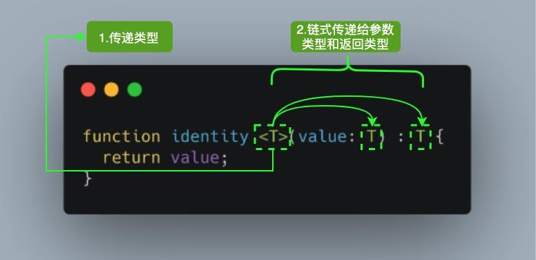

## 泛型



参考上图，当我们调用 `identity<Number>(1)` ，`Number` 类型就像参数 `1` 一样，它将在出现 `T` 的任何位置填充该类型。图中 `<T>` 内部的 `T` 被称为类型变量，它是我们希望传递给 identity 函数的类型占位符，同时它被分配给 value 参数用来代替它的类型：此时 T 充当的是类型，而不是特定的 Number 类型。

其中 `T` 代表 **Type**，在定义泛型时通常用作第一个类型变量名称。但实际上 `T` 可以用任何有效名称代替。除了 `T` 之外，以下是常见泛型变量代表的意思：

- K（Key）：表示对象中的键类型；
- V（Value）：表示对象中的值类型；
- E（Element）：表示元素类型。

其实并不是只能定义一个类型变量，我们可以引入希望定义的任何数量的类型变量。比如我们引入一个新的类型变量 U，用于扩展我们定义的 identity 函数：

```typescript
function identity <T, U>(value: T, message: U) : T {
  console.log(message);
  return value;
}

console.log(identity<Number, string>(68, "Semlinker"));
console.log(identity(68, "Semlinker"))  // 省略尖括号，编译器自动选择这些类型
```

### 1. 泛型接口

```typescript
interface GenericIdentityFn<T> {
  (arg: T): T;
}
```

### 2. 泛型类

```typescript
class GenericNumber<T> {
  zeroValue: T;
  add: (x: T, y: T) => T;
}

let myGenericNumber = new GenericNumber<number>();
myGenericNumber.zeroValue = 0;
myGenericNumber.add = function (x, y) {
  return x + y;
};
```

### 3. 泛型工具类型

为了方便开发者 TypeScript 内置了一些常用的工具类型，比如 `Partial、Required、Readonly、Record 和 ReturnType` 等。出于篇幅考虑，这里我们只简单介绍 Partial 工具类型。不过在具体介绍之前，我们得先介绍一些相关的基础知识，方便读者自行学习其它的工具类型。

#### 3.1 typeof

在 TypeScript 中，`typeof` 操作符可以用来获取一个变量声明或对象的类型。

```typescript
interface Person {
  name: string;
  age: number;
}

const sem: Person = { name: 'semlinker', age: 33 };
type Sem = typeof sem; // -> Person

function toArray(x: number): Array<number> {
  return [x];
}

type Func = typeof toArray; // -> (x: number) => number[]
```

#### 3.2 keyof

`keyof` 操作符是在 TypeScript 2.1 版本引入的，该操作符可以用于获取某种类型的所有键，其返回类型是联合类型。

```typescript
interface Person {
  name: string;
  age: number;
}

type K1 = keyof Person; // "name" | "age"
type K2 = keyof Person[]; // "length" | "toString" | "pop" | "push" | "concat" | "join" ...
type K3 = keyof { [x: string]: Person };  // string | number
```

在 TypeScript 中支持两种索引签名，数字索引和字符串索引：

```typescript
interface StringArray {
  // 字符串索引 -> keyof StringArray => string | number
  [index: string]: string;
}

interface StringArray1 {
  // 数字索引 -> keyof StringArray1 => number
  [index: number]: string;
}
```

为了同时支持两种索引类型，就得要求数字索引的返回值必须是字符串索引返回值的子类。其中的原因就是当使用数值索引时，JavaScript 在执行索引操作时，会先把数值索引先转换为字符串索引。所以 `keyof { [x: string]: Person }` 的结果会返回 `string | number`。

#### 3.3 in

`in` 用来遍历枚举类型：

```typescript
type Keys = "a" | "b" | "c";

type Obj =  {
  [p in Keys]: any;
} // -> { a: any, b: any, c: any }
```

#### 3.4 infer

在条件类型语句中，可以用 infer 声明一个类型变量并且对它进行使用。

```typescript
type ReturnType<T> = T extends (
  ...args: any[]
) => infer R ? R : any;
```

以上代码中 `infer R` 就是声明一个变量来承载传入函数签名的返回值类型，简单说就是用它取到函数返回值的类型方便之后使用。

#### 3.5 extends

有时候我们定义的泛型不想过于灵活或者说想继承某些类等，可以通过 extends 关键字添加泛型约束。

```typescript
interface Lengthwise {
  length: number;
}

function loggingIdentity<T extends Lengthwise>(arg: T): T {
  console.log(arg.length);
  return arg;
}
```

现在这个泛型函数被定义了约束，因此它不再是适用于任意类型：

```typescript
loggingIdentity(3);  // Error, number doesn't have a .length property
```

这时我们需要传入符合约束类型的值，必须包含必须的属性：

```typescript
loggingIdentity({ length: 10, value: 3 });
```

#### 3.6 Partial

`Partial<T>` 的作用就是将某个类型里的属性全部变为可选项 ?。

**定义**

```typescript
/**
 * node_modules/typescript/lib/lib.es5.d.ts
 * Make all properties in T optional
 */
type Partial<T> = {
  [P in keyof T]?: T[P];
};
```

在以上代码中，首先通过 `keyof T` 拿到 `T` 的所有属性名，然后使用 `in` 进行遍历，将值赋给 `P`，最后通过 `T[P]` 取得相应的属性值。中间的 `?` 号，用于将所有属性变为可选。

**示例**

```typescript
interface Todo {
  title: string;
  description: string;
}

function updateTodo(todo: Todo, fieldsToUpdate: Partial<Todo>) {
  return { ...todo, ...fieldsToUpdate };
}

const todo1 = {
  title: "Learn TS",
  description: "Learn TypeScript",
};

const todo2 = updateTodo(todo1, {
  description: "Learn TypeScript Enum",
});
```

在上面的 `updateTodo` 方法中，我们利用 `Partial<T>` 工具类型，定义 `fieldsToUpdate` 的类型为 `Partial<Todo>`，即：

```typescript
{
  title?: string | undefined;
  description?: string | undefined;
}
```

## 装饰器

> 装饰器是一个表达式，该表达式被执行后，返回一个函数，函数的入参分别为 target、name 和 descriptor，执行该函数后，可能返回 descriptor 对象，用于配置 target 对象

需要注意的是，若要启用实验性的装饰器特性，你必须在命令行或 `tsconfig.json` 里启用 `experimentalDecorators` 编译器选项：

**命令行**

```shell
tsc --target ES5 --experimentalDecorators
```

**tsconfig.json**

```json
{
  "compilerOptions": {
    "target": "ES5",
    "experimentalDecorators": true
  }
}
```

### 1. 类装饰器

类装饰器声明:

```typescript
declare type ClassDecorator = <TFunction extends Function>(target: TFunction) => TFunction | void;
```

类装饰器顾名思义，就是用来装饰类的。它接收一个参数：

- target: TFunction - 被装饰的类

```typescript
function Greeter(greeting: string) {
  return function (target: Function) {
    target.prototype.greet = function (): void {
      console.log(greeting);
    };
  };
}

@Greeter("Hello TS!")
class Greeting {
  constructor() {
    // 内部实现
  }
}

let myGreeting = new Greeting();
myGreeting.greet(); // console output: 'Hello TS!';
```

### 2. 属性装饰器

属性装饰器声明：

```typescript
declare type PropertyDecorator = (target: Object, propertyKey: string | symbol) => void;
```

属性装饰器顾名思义，用来装饰类的属性。它接收两个参数：

- target: Object - 被装饰的类
- propertyKey: string | symbol - 被装饰类的属性名

```typescript
function logProperty(target: any, key: string) {
  delete target[key];

  const backingField = "_" + key;

  Object.defineProperty(target, backingField, {
    writable: true,
    enumerable: true,
    configurable: true
  });

  // property getter
  const getter = function (this: any) {
    const currVal = this[backingField];
    console.log(`Get: ${key} => ${currVal}`);
    return currVal;
  };

  // property setter
  const setter = function (this: any, newVal: any) {
    console.log(`Set: ${key} => ${newVal}`);
    this[backingField] = newVal;
  };

  // Create new property with getter and setter
  Object.defineProperty(target, key, {
    get: getter,
    set: setter,
    enumerable: true,
    configurable: true
  });
}

class Person {
  @logProperty
  public name: string;

  constructor(name: string) {
    this.name = name;
  }
}

const p1 = new Person("semlinker");
p1.name = "kakuqo";
```

以上代码定义了一个 `logProperty` 函数，来跟踪用户对属性的操作，当代码成功运行后，在控制台会输出以下结果：

```
Set: name => semlinker
Set: name => kakuqo
```

### 3. 方法装饰器

方法装饰器声明：

```typescript
declare type MethodDecorator = <T>(target:Object, propertyKey: string | symbol, descriptor: TypePropertyDescript<T>) => TypedPropertyDescriptor<T> | void;
```

方法装饰器顾名思义，用来装饰类的方法。它接收三个参数：

- target: Object - 被装饰的类
- propertyKey: string | symbol - 方法名
- descriptor: TypePropertyDescript - 属性描述符

```typescript
function LogOutput(target: Function, key: string, descriptor: any) {
  let originalMethod = descriptor.value;
  let newMethod = function(...args: any[]): any {
    let result: any = originalMethod.apply(this, args);
    if(!this.loggedOutput) {
      this.loggedOutput = new Array<any>();
    }
    this.loggedOutput.push({
      method: key,
      parameters: args,
      output: result,
      timestamp: new Date()
    });
    return result;
  };
  descriptor.value = newMethod;
}

class Calculator {
  @LogOutput
  double (num: number): number {
    return num * 2;
  }
}

let calc = new Calculator();
calc.double(11);
console.log(calc.loggedOutput);   // console ouput: [{method: "double", output: 22, ...}]
```

### 4. 参数装饰器

参数装饰器声明：

```typescript
declare type ParameterDecorator = (target: Object, propertyKey: string | symbol, parameterIndex: number ) => void
```

参数装饰器顾名思义，是用来装饰函数参数，它接收三个参数：

- target: Object - 被装饰的类
- propertyKey: string | symbol - 方法名
- parameterIndex: number - 方法中参数的索引值

```typescript
function Log(target: Function, key: string, parameterIndex: number) {
  let functionLogged = key || target.prototype.constructor.name;
  console.log(`The parameter in position ${parameterIndex} at ${functionLogged} has been decorated`);
}

class Greeter {
  greeting: string;

  constructor(@Log phrase: string) {
    this.greeting = phrase;
  }
}

// console output: The parameter in position 0 at Greeter has been decorated
```