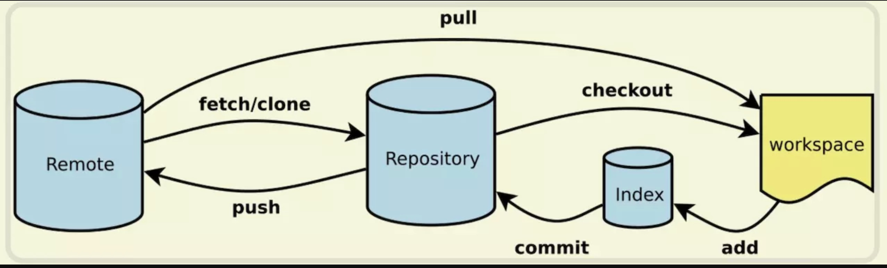

## 配置

配置自动换行: `git config --global core.autocrlf input`

配置密钥:
```bash
# 生成密钥
$ ssh-keygen -t rsa -b 4096 -C 494657028@qq.com

# 测试是否成功
$ ssh -T git@github.com
```

## https协议下提交代码免密码

> git clone https://github.com/username/repo.git

通过上述方式克隆可能需要密码，解决办法：进入当前克隆的项目 `vi repo/.git/config` 编辑 `config`, 按照下面方式修改，你就可以提交代码不用输入密码了。

```diff
[core]
  repositoryformatversion = 0
  filemode = true
  bare = false
  logallrefupdates = true
  ignorecase = true
  precomposeunicode = true
[remote "origin"]
-	url = https://github.com/username/repo.git
+	url = https://用户名:密码@github.com/username/repo.git
  fetch = +refs/heads/*:refs/remotes/origin/*
[branch "master"]
  remote = origin
  merge = refs/heads/master
```

## 新建

新建一个 git 版本库，这个版本库的配置、存储等信息会存储到 .git 文件夹中。

```bash
# 初始化当前项目
git init

# 新建一个项目，并将其初始化 git 版本库
git init [project-name]

# 在指定目录创建一个空的 git 仓库。运行这个命令会创建一个名为 directory，只包含 .git 子目录的空目录
git init --bare <directory>

# 下载一个项目和它的整个代码历史 -> 将一个版本库拷贝到另一个目录中，同时也将分支都拷贝到新的版本库中。这样就可以在新的版本库中提交到远程分支
git clone [url]
```

## 配置

更改配置，可以是版本库的配置，也可以是系统全局的。

```bash
# 显示当前 git 配置
git config --list

# 编辑 git 配置文件
git config -e [--global]

# 输出、设置基本的全局变量
git config --global user.name
git config --global user.name "myName"

# 定义当前用户所有提交使用的作者邮箱
git config --global alias.<alias-name> <git-command>

# 为 git 命令创建一个快捷方式
git config --system core.editor <editor>
```

## 帮助

git 内置了对命令非常详细的解释，可以供我们快速查阅

```bash
# 查找 [所有] 可用命令
git help [-a]

# 在文档当中查找特定的命令
git help init
git help add
git help commit
```

## 状态

显示索引文件（也就是当前工作空间）和当前的头指针指向的提交的不同

```bash
# 显示分支，未跟踪文件，更改和其他不同
git status

# 查看其他的 git status 的用法
git help status
```

## 历史

获取某些文件，某些分支，某次提交等 git 信息

```bash
# 显示 commit 历史，以及每次 commit 发生变更的文件
git log --stat

# 搜索 commit 历史，根据关键词
git log -S [keyword]

# 显示某个 commit 之后所有变动，每个 commit 占一行
git log [tag] HEAD --pretty=format:%s

# 显示某个 commit 之后的所有变动，其 "提交说明" 必须符合搜索条件
git log [tag] HEAD --grep feature

# 显示某个文件的版本历史，包括文件改名
git log --follow [file]
git whatchanged [file]

# 显示指定文件相关的每一次 diff
git log -p [file]

# 显示过去5次提交
git log -5 --pretty --oneline

# 显示所有提交过的用户，按提交次数排序
git shortlog --sn

# 显示某次提交时，某个文件的内容
git show [commit]:[filename]

# 显示当前分支的最近几次提交
git reflog

# 显示指定文件是什么人在什么时间修改过
git blame [file]

# 显示某次提交的元数据和内容变化
git show [commit]

# 显示某次提交发生变化的文件
git show --name-only [commit]
```

## diff

```bash
# 显示暂存区和工作区的差异
git diff

# 仅仅比较统计信息
git diff --stat

# 比较暂存区和版本库差异
git diff --staged
git diff --cached

# 显示暂存区和上一个 commit 的差异
git diff --cached [file]

# 显示工作区和当前分支最新 commit 的差异
git diff HEAD

# 显示两次提交之间的差异
git diff [first-commit] [second-commit]

# 显示今天你写了多少行代码
git diff --shortstat "@{0 day ago}"
```

## 添加

添加文件到当前工作空间中。如果你不使用 git add 将文件添加进去，那么这些文件也不会添加到之后的提交之中

```bash
# 添加一个文件
$ git add test.js

# 添加一个子目录中的文件
$ git add /path/to/file/test.js

# 支持正则表达式
$ git add ./*.js

# 添加指定文件到暂存区
$ git add [file1] [file2] ...

# 添加指定目录到暂存区，包括子目录
$ git add [dir]

# 添加当前目录的所有文件到暂存区
$ git add .

# 添加每个变化前，都会要求确认, 对于同一个文件的多处变化，可以实现分次提交
$ git add -p
```

# 删除

rm 和上面的 add 命令相反，从工作空间中去掉某个文件

```bash
# 移除 test.js
$ git rm test.js

# 移除子目录中的文件
$ git rm /pather/to/the/file/test.js

# 删除工作区文件，并且将这次删除放入暂存区
$ git rm [file1] [file2] ...

# 停止追踪指定文件，但该文件会保留在工作区
$ git rm --cached [file]
```

## 分支

管理分支，可以通过下列命令对分支进行增删改查切换等

```bash
# 列出所有本地分支
git branch

# 列出所有远程分支
git branch -r

# 查看所有的分支和远程分支
git branch -a

# 查看各个分支最后提交信息
git branch -v

# 创建一个新的分支
git branch [branch-name]

# 重命名分支
# git branch -m <旧名称> <新名称>
git branch -m [branch-name] [new-branch-name]

# 编辑分支的介绍
git branch [branch-name] --edit-description

# 新建一个分支，但依然停留在当前分支
git branch [branch-name]

# 新建一个分支，并切换到该分支
git checkout -b [branch]

# 新建一个分支，指向指定commit
git branch [branch] [commit]

# 新建一个分支，与指定的远程分支建立追踪关系
git branch --track [branch] [remote-branch]

# 切换到指定分支，并更新工作区
git checkout [branch-name]

# 切换到上一个分支
git checkout -

# 建立追踪关系，在现有分支与指定的远程分支之间
git branch --set-upstream [branch] [remote-branch]

# 合并指定分支到当前分支
git merge [branch]

# 选择一个commit，合并进当前分支
git cherry-pick [commit]

# 删除分支
git branch -d [branch-name]

# 强制删除某个分支 (未被合并的分支被删除的时候需要强制)
git branch -D <branch>

# 删除远程分支
git push origin --delete [branch-name]
git branch -dr [remote/branch]

# 查看已经被合并到当前分支的分支
git branch --merged

# 查看尚未被合并到当前分支的分支
git branch --no-merged
```

## 检出

将当前工作空间更新到索引所标识的或者某一特定的工作空间

```bash
# 切换到某个分支
git checkout <branch>

# 创建新的分支，并且切换过去
git checkout -b <new_branch>

# 基于branch创建新的new_branch
git checkout -b <new_branch> <branch>

# 把某次历史提交记录checkout出来，但无分支信息，切换到其他分支会自动删除
git checkout $id

# 把某次历史提交记录checkout出来，创建成一个分支
git checkout $id -b <new_branch>

# 恢复暂存区的指定文件到工作区
git checkout [file]

# 恢复某个commit的指定文件到暂存区和工作区
git checkout [commit] [file]

# 恢复暂存区的所有文件到工作区
git checkout .
```

## 远程同步

远程同步的远端分支

```bash
# 下载远程仓库的所有变动
git fetch [remote]

# 显示所有远程仓库
git remote -v

# 显示某个远程仓库的信息
git remote show [remote]

# 增加一个新的远程仓库，并命名
git remote add [shortname] [url]

# 查看远程服务器地址和仓库名称
git remote -v

# 添加远程仓库地址
git remote add origin git@ github:xxx/xxx.git

# 设置远程仓库地址(用于修改远程仓库地址)
git remote set-url origin git@ github.com:xxx/xxx.git

# 删除远程仓库
git remote rm <repository>

# 上传本地指定分支到远程仓库
# 把本地的分支更新到远端origin的master分支上
# git push <远端> <分支>
# git push 相当于 git push origin master
git push [remote] [branch]

# 强行推送当前分支到远程仓库，即使有冲突
git push [remote] --force

# 推送所有分支到远程仓库
git push [remote] --all
```

## reset

```bash
# 重置暂存区的指定文件，与上一次commit保持一致，但工作区不变
git reset [file]

# 重置暂存区与工作区，与上一次commit保持一致
git reset --hard

# 重置当前分支的指针为指定commit，同时重置暂存区，但工作区不变
git reset [commit]

# 重置当前分支的HEAD为指定commit，同时重置暂存区和工作区，与指定commit一致
git reset --hard [commit]

# 重置当前HEAD为指定commit，但保持暂存区和工作区不变
git reset --keep [commit]

# 新建一个commit，用来撤销指定commit
# 后者的所有变化都将被前者抵消，并且应用到当前分支
git revert [commit]

# 恢复最后一次提交的状态
git revert HEAD

# 暂时将未提交的变化移除，稍后再移入
git stash
git stash pop

# 列所有stash
git stash list

# 恢复暂存的内容
git stash apply

# 删除暂存区
git stash drop
```

## 提交

将当前索引的更改保存为一个新的提交，这个提交包括用户做出的更改与信息

```bash
# 提交暂存区到仓库区附带提交信息
git commit -m [message]

# 提交暂存区的指定文件到仓库区
git commit [file1] [file2] ... -m [message]

# 提交工作区自上次commit之后的变化，直接到仓库区
git commit -a

# 提交时显示所有diff信息
git commit -v

# 使用一次新的commit，替代上一次提交
# 如果代码没有任何新变化，则用来改写上一次commit的提交信息
git commit --amend -m [message]

# 重做上一次commit，并包括指定文件的新变化
git commit --amend [file1] [file2] ...
```

## 合并

合并就是将外部的提交合并到自己的分支中

```bash
# 将其他分支合并到当前分支
$ git merge branchName

# 在合并时创建一个新的合并后的提交
# 不要 Fast-Foward 合并，这样可以生成 merge 提交
$ git merge --no-ff branchName
```

## tag

```bash
# 列出所有tag
$ git tag

# 新建一个tag在当前commit
$ git tag [tag]

# 新建一个tag在指定commit
$ git tag [tag] [commit]

# 删除本地tag
$ git tag -d [tag]

# 删除远程tag
$ git push origin :refs/tags/[tagName]

# 查看tag信息
$ git show [tag]

# 提交指定tag
$ git push [remote] [tag]

# 提交所有tag
$ git push [remote] --tags

# 新建一个分支，指向某个tag
$ git checkout -b [branch] [tag]
```

## pull

```bash
# 从远端origin的master分支更新版本库
# git pull <远端> <分支>
$ git pull origin master

# 抓取远程仓库所有分支更新并合并到本地，不要快进合并
$ git pull --no-ff
```

