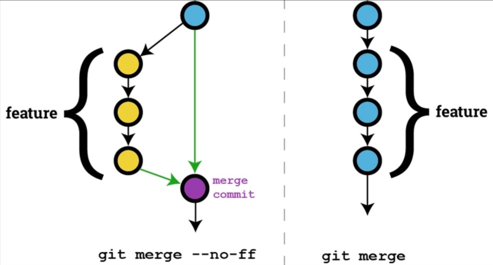

## 主要分支

- origin/master: 源代码 HEAD 总是反应生产状态就绪的主要分支
- origin/develop: 源代码 HEAD 总是反映了下一版本中最新交付的开发更改的状态的主要分支。

当 `develop` 分支中的源代码到达稳定并准备释放时，应该将其合并到 `master` 分支上面并打上tag。

## 功能分支feature

功能分支通常仅存在于开发人员存储库中，而不存在于 `origin`, 一般从 `develop` 分支进行检出，但是必须合并回 `develop` 分支，功能分支命名约定为: `除了master、develop、release-*或者hotfix-*`。

功能分支用于为即将发布或为将来版本开发的功能，其本质是只要功能处于开发阶段，其就会存在，但最终会被合并回 `develop` 分支或者被丢弃。

```bash
# 创建功能分支
$ git checkout -b feature/test develop

# 开发完成加入完成的功能
$ git checkout develop             # 切换到 develop 分支
$ git merge --no-ff feature/test   # 合并 feature/test 分支到 develop 分支
$ git branch -d feature/test       # 删除 feature/test 分支
$ git push origin develop          # 推送到远端 develop 分支
```

`--no-ff` 选项会使合并始终创建新的提交对象，即不使用 `fast-farword` 模式进行合并，这样可以避免丢失有关功能分支历史信息，并将添加的功能一并提交到远端。这样会创建一些空白的提交对象，但是收益会大于成本。



## 发布分支release

发布分支一般从 `develop` 分支检出，但是必须合并回`develop、master`分支，发布分支命名约定为: `release-*`。

发布分支一般为生产版本做准备，可以允许修复一些小错误并为发布准备元数据(版本号、构建日期等)。

```bash
# 创建发布分支
$ git checkout -b release-1.1 develop

# 完成release，合并到master，并打标记
$ git checkout master
$ git merge --no-ff release-1.1
$ git tag -a v1.1
$ git push --tags origin master

# 完成release，合并到develop
$ git checkout develop
$ git merge --no-ff release-1.1

# 完成release，删除分支
$ git branch -d release-1.1
```

## 程序修补分支hotfix

补丁分支一般从 `master` 分支检出，但是必须合并回`develop、master`分支，发布分支命名约定为: `hotfix-*`。

```bash
# 创建补丁分支
$ git checkout -b hotfix-0.1 master

# 完成补丁，合并到master，并打标记
$ git checkout master
$ git merge --no-ff hotfix-0.1
$ git tag -a v1.2
$ git push --tags origin master

# 完成补丁，合并到develop
$ git checkout develop
$ git merge --no-ff hotfix-0.1

# 完成补丁，删除分支
$ git branch -d hotfix-0.1
```
