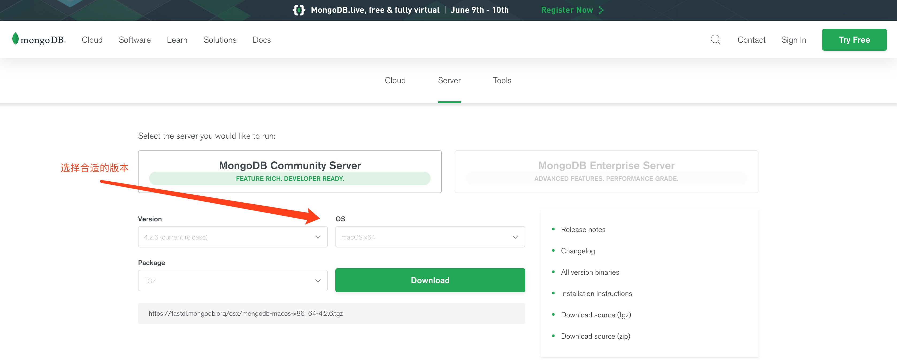

## mongodb简介

- 由 C++ 语言编写的，是一个基于分布式文件存储的开源数据库
- 在高负载的情况下，添加更多的节点，可以保证服务器性能
- 在为 web 应用提供可扩展的高性能数据存储解决方案
- 将数据存储为一个文档，数据结构由 key=>value 键值对组成，类似于 json 对象，字段值可以包含其他文档，数组及文档数组

## mongodb适用的场景和基本概念

**适用场景:**

- 网站数据、缓存等大尺寸、低价值的数据
- 在高伸缩性场景，用于对象及 JSON 数据的存储

**基本概念:**

- 数据库: mongodb的一个实例可以拥有一个或多个相互独立的数据库，每个数据库都拥有自己独立的集合
- 集合: 可以看作是拥有动态数据的表
- 文档: 文档是 mongodb 中基本的数据单元，类似于 RDB 的行。文档是键值对的一个有序集合，单个文档最大 16M
- _id: 每个文档都有个特殊的 `_id`，在文档所属集合中是唯一的
- JavaScript shell: mongodb自带一个功能强大的 JavaScript shell，可以用于管理或操作 mongodb

## mongodb安装

[mongodb安装](https://www.mongodb.com/download-center/community)，选择适合自己的版本。如果是 macos 系统的话，可以用 `brew install mongodb` 安装。



## mongodb启动与连接

## 数据库操作

### 使用数据库

```bash
# use db_name，
use school;
```

## 参考

[mongodb想速成吗，这个系列教程你可以看看(1)](https://juejin.im/post/5ca0110ee51d45452a07916b)
