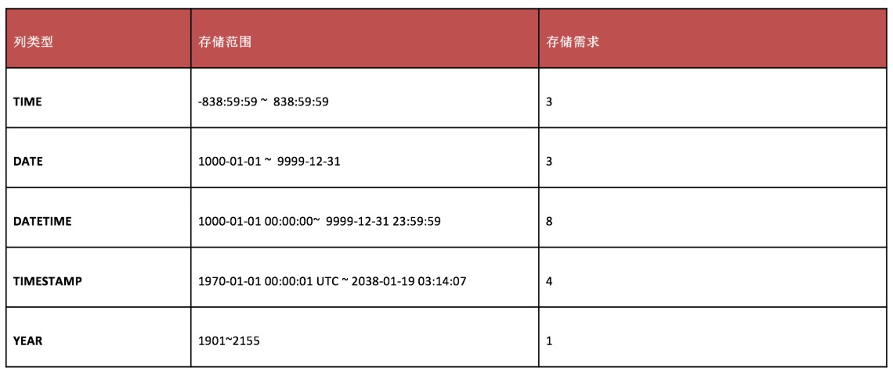

## 数值型

### 整数型

### 浮点型

## 字符串类型

- `CHAR`类型比`VARCHAR`类型高效，`CHAR`相当于拿空间换时间，`VARCHAR`拿时间换空间
- `CHAR`默认存储数据的时候，后面会用空格填充到指定长度；而在检索的时候会去掉后面空格；`VARCHAR`在保存的时候不进行填充，尾部的空格会留下
- `TEXT`列不能有默认值,检索的时候不存在大小写转换

## 时间日期类型

## 二进制类型
