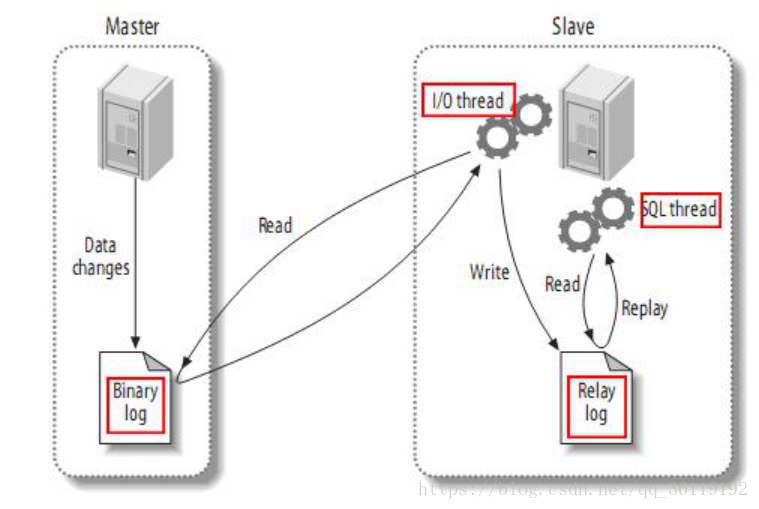

在Mysql中，默认只开启了错误日志。如果想开启其他的日志，需要手动在 `/etc/my.cnf` 配置文件中开启

## 日志类型

- **错误日志**：记录启动、运行或停止时出现的问题，一般也会记录警告信息
- **查询日志**：记录建立的客户端连接和执行的语句(不应该开启)
- **慢查询日志**：记录所有执行时间超过 long_query_time 秒的所有查询或不使用索引的查询，可以帮我们定位服务器性能问题。
- **二进制日志**：任何引起或可能引起数据库变化的操作，主要用于复制和即时点恢复。
- **中继日志**：从主服务器的二进制日志文件中复制而来的事件，并保存为的日志文件
- **事务日志**：记录InnoDB等支持事务的存储引擎执行事务时产生的日志

## 数据库的组从复制

主从复制是MySQL中最重要的功能之一。主从复制是指一台服务器充当主数据库服务器，另一台或多台服务器充当从数据库服务器，主服务器中的数据自动复制到从服务器之中。对于多级复制，数据库服务器即可充当主机，也可充当从机。MySQL主从复制的基础是主服务器对数据库修改记录二进制日志，从服务器通过主服务器的二进制日志自动执行更新

### 主从复制的类型

> 基于语句的复制：

- 描述: 主服务器上面执行的语句在从服务器上面再执行一遍
- 问题: 时间上可能不完全同步造成偏差，执行语句的用户也可能不是同一个用户

> 基于行的复制

- 描述: 把主服务器上面改编后的内容直接复制过去，而不关心到底改变该内容是由哪条语句引发的
- 问题: 比如一个工资表中有一万个用户，我们把每个用户的工资+1000，那么基于行的复制则要复制一万行的内容，由此造成的开销比较大，而基于语句的复制仅仅一条语句就可以了

> 混合类型的复制

- 描述: MySQL默认使用基于语句的复制，当基于语句的复制会引发问题的时候就会使用基于行的复制，MySQL会自动进行选择

### 主从复制原理

1. 主服务器上面的任何修改都会保存在二进制日志`Binary log`里面
2. 从服务器上面启动一个`I/O thread`，连接到主服务器上面请求读取二进制日志，然后把读取到的二进制日志写到本地的一个`Realy log`里面
3. 从服务器上面开启一个`SQL thread`定时检查`Realy log`，如果发现有更改立即把更改的内容在本机上面执行一遍



### 主从复制的步骤

- 主服务器：ip：192.168.10.139   系统：Centos7        数据库：MySQL
- 从服务器：ip：192.168.10.129   系统：Centos7        数据库：MySQL
- **注意: 在进行主从配置之前，两个服务器上的数据库的信息要完全一致！！！**:

> 主服务器配置

1. 修改主服务器配置文件 `/etc/my.cnf`，修改完后需要重启 mysql 服务：systemctl restart mysql

```bash
[mysqld]
log-bin=mysql-bin         // 启用二进制日志(必选)
server-id=139             // 设置服务器唯一ID，一般取IP最后一段(必选)
binlog-do-db=140          // 指定对db_nameA记录二进制日志(可选)
binlog-ignore-db=mysql    // 指定不对db_namB记录二进制日志(可选)
```

2. 为从服务器添加 mysql 账户并配置权限，在主服务器上，必须为从服务器创建一个用来连接主服务器的用户，并设置 replication slave 权限

`mysql>grant replication slave on *.* to backup@'192.168.10.129' identified by '123';`

3. 刷新权限

`mysql>flush privileges;`

4. 验证是否开启主从复制

`mysql>select * from user where user = 'backup' \G;`

5. 查看主服务器正在使用二进制日志状态

`mysql>show master status;`

> 从服务器配置

1. 修改从服务器配置文件 `/etc/my.cnf`，修改完后需要重启 mysql 服务: systemctl restart mysql

```bash
[mysqld]
server-id=129              //必须服务器唯一ID，一般取IP最后一段(必选)
```

2. 进入数据库，设置主服务器信息

```bash
mysql> change master to master_host='192.168.10.139',
    -> master_user='backup',
    -> master_password='123',
    -> master_log_file='mysql-bin.000001',  // master status file
    -> master_log_pos=245;                  // master status position
```

3. 开启从服务器复制二进制日志，实现同步功能

`slave start;`

4. 验证数据库相关参数

` show slave status \G;`

## 数据库的备份和还原

> 衡量备份还原的指标：

- RPO：恢复点目标，恢复的程度
- RIO：恢复时间目标，恢复花费的时间

> 备份方式：

- 冷备份：拷贝数据库目录，需要先停机再备份，对于在线不间断提供业务的不适用
- 快照备份：lvm快照，mysql 装在 lvm 创建的分区，可以热备份(在线备份)，缺点在于所有的文件，包括数据、日志等需要存放在一个逻辑卷中，然后再对卷快照备份，只支持本地备份，生产环境用的也比较少
- 逻辑备份： mysqldump 工具，单线程备份，备份速度较慢；mydumper 工具，mysqldump 升级版，有限制条件

> 备份单个库：

- 备份：mysqldump -uroot -p dbname1 > 1.sql
- 还原：mysql -uroot -p dbname2 < 1.sql
- 注意：这里还原的时候这个 dbname2 是数据库名，必须要有，dbname1 和 dbname2 可以不一致

> 备份多个库：

- 备份：mysqldump -uroot -p --database db1 db2 > 1.sql
- 还原： mysql  -uroot -p < 1.sql

> 备份全部库：

- 备份：mysqldump -uroot -p --all-databases > 1.sql
- 还原：mysql -uroot -p < 1.sql

> 备份单个表：

- 备份：mysqldump dbname1 tb1 > 1.sql
- 还原：mysql -uroot -p dbname2 < 1.sql
- 注意：这里还原的时候这个 dbname2 是数据库名，必须要有，dbname1 和 dbname2 可以不一致

## 参考

[数据库日志、主从复制、备份和还原](https://blog.csdn.net/qq_36119192/article/details/82862621)
