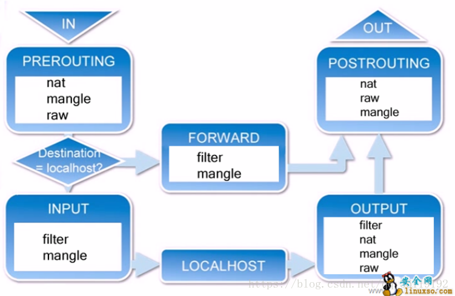
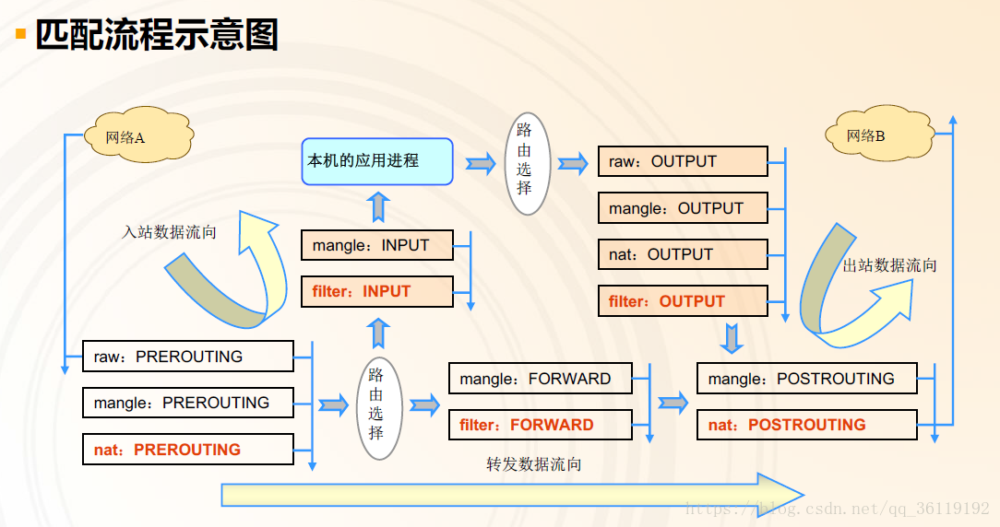
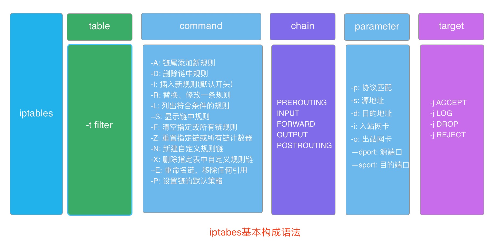
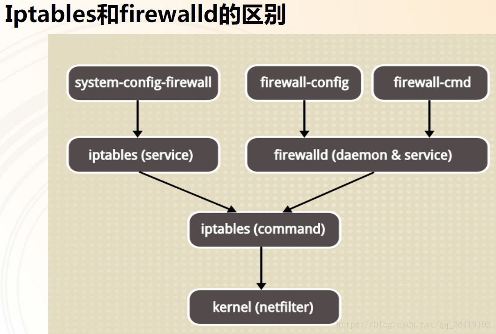

## Netfilter

netfilter 是 Linux 2.4 内核引入的全新的包过滤引擎，由一些数据包过滤表组成，这些表包含内核用来控制信息包过滤的规则集。`iptabes` 等都是在用户空间修改过滤表规则的便捷工具。

netfilter 在数据包必须经过且可以读取规则的位置，共设有 5 个控制关卡。这五个关卡处的检查规则分别放在 5 个规则链(钩子函数)中, **也就是说 5 条链对应着数据包传输路径中的 5 个控制关卡，链中的规则会在对应的关卡检查和处理**。任何一个数据包，只要经过本机，必须经过 5 个链中的某个或某几个。

- **PREROUTING**: 数据包刚进入网络接口之后，路由之前
- **INPUT**: 数据包从内核进入用户空间
- **FORWARD**: 在内核空间中，从一个网络接口进入，到另一个网络接口去。转发过滤
- **OUTPUT**: 数据包从用户空间留到内核空间
- **POSTROUTING**: 路由后，数据包离开网络接口前

链其实就是包含众多规则的检查清单，每一条链中包含很多规则。当一个数据包到达一个链时，系统就会从链中第一条规则开始检查，看该数据包是否满足规则所定义的条件。如果满足，系统就会根据该条规则所定义的方法处理该数据包，否则就继续检查下一条规则，如果该数据包不符合链中任何一条规则，系统就会根据该链预先定义的默认策略来处理数据包。

## 数据包的传输过程

- 当一个数据包进入网卡时，它首先进入 `PREROUTING` 链，内核根据数据包目的 IP 判断是否需要转送出去
- 如果数据包就是进入本机的，它就会沿着图向下移动，到达 `INPUT` 链。数据包到了 `INPUT` 链后，任何进程都会收到它。本机上运行的程序可以发送数据包，这些数据包会经过 `OUPUT` 链，然后到达 `POSTROUTING` 链输出
- 如果数据包是要转发出去的，且内核允许转发，数据包就会如图琐事向右移动，经过 `FORWARD` 链，然后到达 `POSTROUTING` 链输出。



可以看出，刚从网络接口进入的数据包尚未进行路由决策，还不知道数据要走向哪里，所有进出口没办法实现数据过滤，需要在内核空间设置转发关卡、进入用户空间关卡和开用户空间关卡。

# iptables

iptables 是用来管理防火墙的的工具，属于静态防火墙，我们通过 iptables 将过滤规则写入内核，然后 Netfilter 再根据规则进行过滤数据包。所以实际上 iptables 是通过调用 Netfilter 来进行防火墙管理的，它本身不具备过滤数据包的功能。iptables 程序位于 `/sbin/iptables`，配置文件位于 `/etc/sysconfig/iptables`

iptables 中也有和 Netfilter 中一模一样的5种规则链，还多了 4 个规则表。规则表的作用是容纳各种规则链。规则表的划分依据是防火墙规则的作用。规则表之间的匹配顺序: `raw --> mangle --> nat --> filter`。

- **raw**: 快速通道功能。只涉及 `PREROUTING、OUTPUT` 两条链, 为了提高效率，优先级最高，符合 raw 表规则的数据包会跳过一些检查
- **mangle**: 数据包修改功能。每条链上都可以做修改操作，修改报元数据，做防火墙标记等
- **nat**: 地址转换功能。nat 转换只涉及 `PREROUTING、OUTPUT、POSTROUTING` 三条链，可通过转发让局域网机器连接互联网
- **filter**: 数据包过滤功能。只涉及 `INPUT、FORWARD、OUTPUT` 三条链，是 iptables 命令默认操纵的表



## iptables基本语法

> 数据包常见控制类型

- **ACCEPT**: 允许通过
- **DROP**: 直接丢弃，不给出任何回应
- **REJECT**: 拒绝通过，必要时会给出提示
- **LOG**: 记录日志信息，然后传给下一条规则继续匹配

> 语法构成

`iptables [-t 表名] 选项 链名 条件 [-j 控制类型]`

- 不指定链名时，默认指定表内的所有链
- 除非设置链的默认策略，否则必须指定匹配条件
- 选项、链名、控制类型使用大写字母，其余均为小写



> 规则的匹配条件

**通用匹配**：可直接使用，不依赖于其他条件或扩展。包括网络协议、ip地址、网络接口等

- 协议匹配：-p  协议名               `iptables -A INPUT -p icmp -j DROP`
- 地址匹配：-s 源地址 、-d 目的地址    `iptables -A INPUT -s 192.168.10.0/24 -j DROP`
- 接口匹配：-i 入站网卡 、-o 出站网卡  `iptables -A INPUT -i eth0 -p icmp -j DROP`

**隐含匹配**：要求以特定的协议匹配作为前提，包括端口、TCP标记、ICMP类型等条件

- 端口匹配：--sport 源端口 、--dport 目的端口   `iptables -A INPUT -p tcp --dprot 20:21 -j ACCEPT`
- TCP标记匹配：--tcp-flags 检查范围 被设置的标记
- ICMP类型匹配：--icmp-type ICMP类型
     
**显式匹配**：要求以 " -m  扩展模块" 的形式明确指出类型，包括多端口、MAC地址、IP范围、数据包状态等

- 多端口匹配：-m multiport --sport 源端口列表  -m multiport --dport 目的端口列表  `iptables -A INPUT  -p tcp -m multiport --dport 25,80,110,143 -j ACCEPT`
- IP范围匹配：-m iprange --src-range IP范围                                    `iptables -A FORWARD -p tcp -m iprange --src-range 192.168.4.21-192.168.4.28 -j ACCEPT`
- MAC地址匹配：-m mac --mac-source  MAC地址                                    `iptables -A INPUT -m mac --mac-source 00:0c:29:c0:55:3f -j DROP`
- 状态匹配: -m state --state 连接状态

> 添加新的规则

- `iptables -t filter -A INPUT -p tcp -j ACCEPT`    在filter表的INPUT链中加入一条允许所有tcp协议的规则
- `iptables -A INPUT -p tcp -j ACCEPT`             未加表名时，默认是filter表，所以和上面的语句一个意思
- `iptables -I INPUT -p udp -j ACCEPT`              在filter表的INPUT链中的开头加一条允许所有udp协议的规则
- `iptables -I INPUT 3 -p icmp -j ACCEPT`           在filter表中的INPUT链中的第3条加入一条允许所有icmp协议的规则

> 删除，清空规则(暂时，重启失效)

- `iptables -D INPUT 3`          清除filter表中的INPUT链中的第3条规则
- `iptables -t raw -F`           清除raw 表中的所有规则
- `iptables -F`                  清除filter表中的规则，重启服务后恢复

> 查看规则列表

```bash
-L：列出所有的规则条目(默认查看的是filter表)
-n：以数字形式显示地址、端口等信息(地址用数字表示)
-v：以更详细的方式显示规则信息(显示比特流，发包的数量等信息)
--line-numbers：查看规则时，显示规则的序号
```

- `iptables -L`      列出filter表的规则链的规则条目
- `iptables -nvL`    列出filter表中的规则链

> 设置默认规则

- `iptables -t nat -P OUTPUT ACCEPT`     给nat表中的OUTPUT链设置默认的ACCEPT规则

> 规则的备份和还原

- 导出: `iptables-save > /tmp/yutiy/iptables.txt`
- 还原: `iptables-restore < /tmp/yutiy/iptables.txt`

> 规则永久生效

iptables不是一个守护进程，我们修改只是当前的修改，重启服务或重启系统就会失效。要想使规则永久生效，需要保存规则：`service  iptables  save`，使我们当前的配置保存到配置文件 `/etc/sysconfig/iptables` 中，然后重启服务或者重启主机，使规则加载到内存，才能使配置永久生效。防火墙的运行需要建立在网络配置正常的前提下。

- `service iptables start/stop/restart`    开启/停止/重启 iptables服务
- `chkconfig --level 5 iptables on/off`　　 使服务开启自启/不自启

## 使用示例

```bash
iptables -F                # 删除 iptables 现有规则
iptables -L [-v[vv] -n]    # 查看 iptables 规则
iptables -A INPUT -i eth0 -p tcp --dport 80 -m state --state NEW,ESTABLISHED -j ACCEPT      # 在 INPUT 链尾添加一条规则
iptables -I INPUT 2 -i eth0 -p tcp --dport 80 -m state --state NEW,ESTABLISHED -j ACCEPT    # 在 INPUT 链中插入为第二条规则
iptables -D INPUT 2       # 删除 INPUT 链中第 2 条规则
iptables -R INPUT 3 -i eth0 -p tcp --dport 80 -m state --state NEW,ESTABLISHED -j ACCEPT    # 替换修改第三条规则
iptables -P INPUT DROP    # 设置 INPUT 链的默认策略为 DROP

# 允许远程主机进行 SSH 连接
iptables -A INPUT -i eth0 -p tcp --dport 22 -m state --state NEW,ESTABLISHED -j ACCEPT
iptables -A OUPUT -o eth0 -p tcp --sport 22 -m state --state ESTABLISHED -j ACCEPT

# 允许本地主机进行 SSH 连接
iptables -A OUPUT -o eth0 -p tcp --dport 22 -m state --state NEW,ESTABLISHED -j ACCEPT
iptables -A INPUT -i eth0 -p tcp --sport 22 -m state --state ESTABLISHED -j ACCEPT

# 允许 http 请求
iptables -A INPUT -i eth0 -p tcp --dport 80 -m state --state NEW,ESTABLISHED -j ACCEPT
iptables -A OUPUT -o eth0 -p tcp --sport 80 -m state --state ESTABLISHED -j ACCEPT

# 限制 ping 192.168.0.1 主机的数据包数，平均 2s 一个，最多不超过 3 个
iptables -A INPUT -i eth0 -d 192.168.0.1 -p icmp --icmp-type 8 -m limit --limit 2/second --limit-burst 3 -j ACCEPT

# 限制 SSH 连接速率(默认策略是DROP)
iptables -I INPUT 1 -p tcp --dport 22 -d 192.168.0.1 -m state --state ESTABLISHED -j ACCEPT
iptables -I INPUT 2 -p tcp --dport 22 -d 192.168.0.1 -m limit --limit 2/minute --limit-burst 2 -m state --state NEW -j ACCEPT

# 防止 syn 攻击(限制 syn 的请求速度)
iptables -N syn-flood
iptables -A INPUT -p tcp --syn -j syn-flood
iptables -A syn-flood -m limit --limit 1/s --limit-burst 4 -j ACCEPT
iptables -A syn-flood -j DROP

# 防止 syn 攻击(限制单个ip的最大syn连接数)
iptables -A INPUT -i eth0 -p tcp --syn -m connlimit --connlimit-above 15 -j DROP
iptables -I INPUT -p tcp --dport 22 -m state --state NEW -m recent --set --name SSH   # 利用 recent 模块抵御 DOS 攻击
iptables -I INPUT -p tcp --dport 22 -m connlimit --connlimit-above 3 -j DROP          # 单个 ip 最多连接 3 个会话
iptables -I INPUT -p tcp --dport 22 -m state NEW -m recent --update --seconds 300 --hitcount 3 --name SSH -j DROP # 只要新的连接请求，就加入到 ssh 列表中，5分钟内尝试次数超过 3 次，就拒绝服务。5分钟后恢复

iptables -I INPUT -p tcp --dport 80 -m connlimit --connlimit-above 30 -j DROP         # 防止单个IP访问量过大
iptables -A OUTPUT -m state --state NEW -j DROP   # 防止反弹木马
iptables -A INPUT -p icmp --icmp-type echo-request -m limit --limit 1/m -j ACCEPT     # 防止 ping 攻击

# 允许可以ping别人，不允许别人ping自己
iptables -A OUTPUT -p icmp --icmp-type 8 -j ACCEPT
iptables -A INPUT -p icmp --icmp-type 0 -j ACCEPT

# 127.0.0.1明确定义
iptables -A INPUT -s 127.0.0.1 -d 127.0.0.1 -j ACCEPT
iptables -A OUTPUT -s 127.0.0.1 -d 127.0.0.1 -j ACCEPT

# SNAT基于源地址转换。许多内网用户通过一个外网端口上网，将内网地址转换为一个外网IP，公用外网IP访问外网资源
iptables -t nat -A POSTROUTING -s 192.168.10.1/24 -j SNAT --to-source 172.16.100.1

# 当外网地址不固定时，将外网地址转化成 MASQUERADE(动态伪装), 其可以实现自动读取外网网卡获取的 IP 地址
iptables -t nat -A POSTROUTING -s 192.168.10.1/24 -j MASQUERADE

# DNAT 目标地址转换。
iptables -t nat -A POSTROUTING -d 192.168.10.1 -p tcp --dport 80 -j DNAT --to-destination 172.16.100.1:80
```

# Firewalld

> firewalld的配置模式

firewalld的配置文件以xml格式为主（主配置文件firewalld.conf例外），他们有两个存储位置:

- `/etc/firewalld/services/`: 用户自定义配置文件
- `/usr/lib/firewalld/services/`: 系统配置文件，预置文件，尽量不要修改



> 过滤规则集合: zone

- 一个 zone 就是一套过滤规则，数据包必须经过某个 zone 才能入站或出站。不同 zone 中负责粒度粗细、安全强度度不尽相同。
- 每个 zone 单独对应一个 xml 文件，文件名为 `<zone名称>.xml`，然后在其中添加过滤规则即可
- 每个 zone 都有一个默认的处理行文，包括: default(缺省)、ACCEPT、REJECT、DROP
- firewalld 提供了 9 个 zone:
  - **drop**: 任何流入的包都被丢弃，不做任何响应。只允许流出的数据包
  - **block**: 任何流入的包都被拒绝，返回icmp-host-prohibited报文(ipv4)或icmp6-adm-prohibited报文(ipv6)。只允许由该系统初始化的网络连接
  - **public**: 默认的zone。部分公开，不信任网络中其他计算机，只放行特定服务
  - **external**: 只允许选中的服务通过，用在路由器等启用伪装的外部网络。认为网路中其他计算器不可信
  - **dmz**: 允许隔离区(dmz)中的电脑有限的被外界网络访问，只允许选中的服务通过
  - **work**: 用在工作网络。你信任网络中的大多数计算机不会影响你的计算机，只允许选中的服务通过
  - **home**: 用在家庭网络。信任网络中的大多数计算机，只允许选中的服务通过
  - **internal**: 用在内部网络。信任网络中的大多数计算机，只允许选中的服务通过
  - **trusted**: 允许所有网络连接，即使没有开放任何服务，那么使用此zone的流量照样通过（一路绿灯

> service

- 一个 service 中可以配置特定的端口(将端口和service名字关联)。zone中加入 service 规则就等效于直接加入了 port 规则，但是使用 service 更容易理解和管理
- 定义 service 的方式，添加`<service名称>.xml文件，在其中加入要关联的端口即可`

service示例: **ssh.xml**

```xml
<?xml version="1.0" encoding="utf-8"?>
<service>
  <short>SSH</short>
  <description>Secure Shell (ssh)</description>
  <port protocol="tcp" port="22" />
</service>
```

> 过滤规则

- **source**: 根据数据包源地址过滤，相同的source只能在一个zone中配置
- **interface**: 根据接收数据包的网卡过滤
- **service**: 根据服务名过滤（实际是查找服务关联的端口，根据端口过滤），一个service可以配置到多个zone中
- **port**: 根据端口过滤
- **imcp-block**: icmp报文过滤，可按照icmp类型设置
- **masquerade**: ip地址伪装，即将接收到的请求的源地址设置为转发请求网卡的地址（路由器的工作原理
- **orward-port**: 端口转发
- **rule**: 自定义规则，与itables配置接近。rule结合--timeout可以实现一些有用的功能，比如可以写个自动化脚本，发现异常连接时添加一条rule将相应地址drop掉，并使用--timeout设置时间段，过了之后再自动开放

> firewall-cmd

```bash
firewall-cmd --version
firewall-cmd --help
firewall-cmd --state                               # 查看firewalld服务状态
firewall-cmd --reload                              # 修改配置文件后，动态加载，不会断开连接。
firewall-cmd --complete-reload                     # 完全重新加载看，会断开连接。类似重启。
firewall-cmd --panic-on/--panic-off/--query-panic  # panic模式开启/关闭/查询。panic模式会丢弃所有出入站的数据包，一段时间后所有连接都会超时中断。
firewall-cmd --get-active-zones                    # 查看所有绑定了source, interface和默认的zone，以及各个zone的生效条件。
firewall-cmd --set-default-zone=ZONE               # 设置默认的zone，也可以修改firewalld.conf中的DefaultZone选项。

firewall-cmd --zone=xxxx --list-all

# 反向查询：根据source或interface查询对应的zone
firewall-cmd --get-zone-of-interface=interface
firewall-cmd --get-zone-of-source=source[/mask]
```

部分

- `--zone=ZONE`        指定命令作用的zone，省缺的话命令作用于默认zone
- `--permanent`        有此参数表示命令只是修改配置文件，需要reload才能生效；无此参数则立即在当前运行的实例中生效，不过不会改动配置文件，重启firewalld服务就没效果了。
- `--timeout=seconds`  表示命令效果持续时间，到期后自动移除，不能和--permanent同时使用。例如因调试的需要加了某项配置，到时间自动移除了，不需要再回来手动删除。也可在出现异常情况时加入特定规则，过一段时间自动解除。

> zone文件配置规则

```xml
<?xml version="1.0" encoding="utf-8"?>
<zone target="default">   <!--target属性为zone的默认处理行为，可选值：default(省缺),   ACCEPT,   %%REJECT%%,  DROP -->
  <short>Demo</short>
  <description>demo...</description>
  <source address="address[/mask]">
  <interface name="ifcfg-em1"/>     <!--也可在网卡配置文件ifcfg-*中配置，只需要加入 ZONE=public -->
  <service name="ssh"/>
  <port port="portid[-portid]" protocol="tcp|udp"/>
  <icmp-block name="echo-request"/>   <!--ping报文-->
  <masquerade/>
  <forward-port port="portid[-portid]" protocol="tcp|udp" [to-port="portid[-portid]"] [to-addr="ipv4address"]/>

  <rule [family="ipv4|ipv6"]>
    [ <source address="address[/mask]" [invert="bool"]/> ]
    [ <destination address="address[/mask]" [invert="bool"]/> ]
    [
      <service name="string"/> |
      <port port="portid[-portid]" protocol="tcp|udp"/> |
      <protocol value="protocol"/> |
      <icmp-block name="icmptype"/> |
      <masquerade/> |
      <forward-port port="portid[-portid]" protocol="tcp|udp" [to-port="portid[-portid]"] [to-addr="address"]/>
    ]
    [ <log [prefix="prefixtext"] [level="emerg|alert|crit|err|warn|notice|info|debug"]/> [<limit value="rate/duration"/>] </log> ]
    [ <audit> [<limit value="rate/duration"/>] </audit> ]
    [ <accept/> | <reject [type="rejecttype"]/> | <drop/> ]
    </rule>
</zone>
```

> 使用firewall-cmd配置规则

```bash
# zone的默认的行为
firewall-cmd --permanent [--zone=zone] --get-target
firewall-cmd --permanent [--zone=zone] --set-target=target

# 配置source，相同的source只能在一个zone中配置,否则会提示Error: ZONE_CONFLICT 。
firewall-cmd [--permanent] [--zone=zone] --list-sources                        # 显示绑定的source
firewall-cmd [--permanent] [--zone=zone] --query-source=source[/mask]          # 查询是否绑定了source
firewall-cmd [--permanent] [--zone=zone] --add-source=source[/mask]            # 绑定source，如果已有绑定则取消。
firewall-cmd [--zone=zone] --change-source=source[/mask]                       # 修改source，如果原来未绑定则添加绑定。
firewall-cmd [--permanent] [--zone=zone] --remove-source=source[/mask]         # 删除绑定

# interface   如eth0, 也可以在网卡配置文件ifcfg-*中加入  ZONE=ZONE名
firewall-cmd [--permanent] [--zone=zone] --list-interfaces
firewall-cmd [--permanent] [--zone=zone] --add-interface=interface
firewall-cmd [--zone=zone] --change-interface=interface
firewall-cmd [--permanent] [--zone=zone] --query-interface=interface
firewall-cmd [--permanent] [--zone=zone] --remove-interface=interface

# service
firewall-cmd [--permanent] [--zone=zone] --list-services
firewall-cmd [--permanent] [--zone=zone] --add-service=service [--timeout=seconds]
firewall-cmd [--permanent] [--zone=zone] --remove-service=service
firewall-cmd [--permanent] [--zone=zone] --query-service=service

# port
firewall-cmd [--permanent] [--zone=zone] --list-ports
firewall-cmd [--permanent] [--zone=zone] --add-port=portid[-portid]/protocol [--timeout=seconds]
firewall-cmd [--permanent] [--zone=zone] --remove-port=portid[-portid]/protocol
firewall-cmd [--permanent] [--zone=zone] --query-port=portid[-portid]/protocol

# icmp-block, 默认允许所有ICMP通过
firewall-cmd --get-icmptypes # 查看所有支持的ICMP类型：destination-unreachable echo-reply echo-request parameter-problemr-solicitation source-quench time-exceeded
firewall-cmd [--permanent] [--zone=zone] --list-icmp-blocks
firewall-cmd [--permanent] [--zone=zone] --add-icmp-block=icmptype [--timeout=seconds]
firewall-cmd [--permanent] [--zone=zone] --remove-icmp-block=icmptype
firewall-cmd [--permanent] [--zone=zone] --query-icmp-block=icmptype

# masquerade
firewall-cmd [--permanent] [--zone=zone] --add-masquerade [--timeout=seconds]
firewall-cmd [--permanent] [--zone=zone] --remove-masquerade
firewall-cmd [--permanent] [--zone=zone] --query-masquerade

# 端口转发
firewall-cmd [--permanent] [--zone=zone] --list-forward-ports
firewall-cmd [--permanent] [--zone=zone] --add-forward-port=port=PORT[-PORT]:proto=PROTOCAL[:toport=PORT[-PORT]][:toaddr=ADDRESS[/MASK]][--timeout=SECONDS]
firewall-cmd [--permanent] [--zone=zone] --remove-forward-port=port=PORT[-PORT]:proto=PROTOCAL[:toport=PORT[-PORT]][:toaddr=ADDRESS[/MASK]]
firewall-cmd [--permanent] [--zone=zone] --query-forward-port=port=PORT[-PORT]:proto=PROTOCAL[:toport=PORT[-PORT]][:toaddr=ADDRESS[/MASK]]

# rule规则，  'rule'是将xml配置中的<和/>符号去掉后的字符串，如 'rule family="ipv4" source address="1.2.3.4" drop'
firewall-cmd [--permanent] [--zone=zone] --list-rich-rules
firewall-cmd [--permanent] [--zone=zone] --add-rich-rule='rule' [--timeout=seconds]
firewall-cmd [--permanent] [--zone=zone] --remove-rich-rule='rule'
firewall-cmd [--permanent] [--zone=zone] --query-rich-rule='rule'
```

> 防火墙选择

- systemctl mask iptables.service   // 屏蔽iptables服务
- systemctl start firewalld.service
- systemctl enable firewalld.service   


# 参考

- [Linux防火墙配置(iptables, firewalld)](https://www.cnblogs.com/hftian/p/8280841.html)
- [Linux中的防火墙(Netfilter、Iptables、Firewalld)](https://blog.csdn.net/qq_36119192/article/details/82662026#iptables%E5%81%9A%E7%AB%AF%E5%8F%A3%E8%BD%AC%E5%8F%91)
