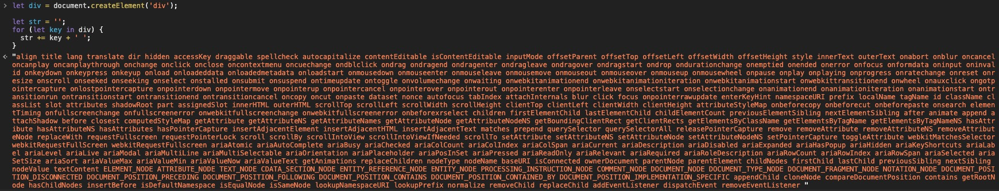

## 为什么需要Virtual Dom

操作 DOM 是很耗费性能的一件事情，例如将一个简单的 div 元素的所有属性值打印出来:

```js
let div = document.createElement('div');

let str = '';
for (let key in div) {
  str += key + ' ';
}
```

那么打印出来的 str 为:


所以，真正的DOM元素是非常庞大的，因为浏览器把DOM设计地非常复杂，所以当我们频繁地去更新DOM时，会产生一定的性能问题。可以想象，用简单粗暴的方法将整个DOM结构用innerHTML修改到页面上，这样进行重绘整个视图层是相当消耗性能的。那我们更新DOM时，能不能只更新修改的地方呢？

## Virtual Dom算法简述

1. 通过 JS 模拟实现 DOM
2. 只对比同层节点来来新旧对象的差异，从而更新 DOM。对比步骤如下:
  - 首先从上至下，从左往右遍历对象，也就是树的深度遍历，这一步中会给每个节点添加索引，便于最后渲染差异
  - 一旦节点有子元素，就去判断子元素是否有不同

## 创建 DOM 元素

```js
export default class Element {
  /**
   * @param {String} tag 'div'
   * @param {Object} props { class: 'item' }
   * @param {Array} children [ Element1, 'text']
   * @param {String} key option
   */
  constructor(tag, props, children, key) {
    this.tag = tag；
    this.props = props；

    if (Array.isArray(children)) {
      this.children = children；
    } else if (isString(children)) {
      this.key = children；
      this.children = null;
    }

    if (key) this.key = key;
  }

  // 渲染
  render() {
    let root = this._createElement(
      this.tag,
      this.props,
      this.children,
      this.key
    );
    document.body.appendChild(root);
    return root;
  }

  // 创建节点
  _createElement(tag, props, child, key) {
    let el = document.createElement(tag);  // 通过 tag 创建节点

    // 设置节点属性
    if (key) el.setAttribute('key', key);
    for (const key in props) {
      if (props.hasOwnProperty(key)) {
        const value = props[key];
        el.setAttribute(key, value);
      }
    }

    // 递归添加子节点
    if (child) {
      child.forEach(element => {
        let child
        if (element instanceof Element) {
          child = this._createElement(
            element.tag,
            element.props,
            element.children,
            element.key
          );
        } else {
          child = document.createTextNode(element);
        }
        el.appendChild(child);
      })
    }
    return el;
  }
}
```

## 树的递归

首先来实现树的递归算法，在实现该算法前，先来考虑下两个节点对比会有几种情况:

1. 新的节点的 tagName 或者 key 和旧的不同，这种情况代表需要替换旧的节点，并且也不再需要遍历新旧节点的子元素了，因为整个旧节点都被删掉了
2. 新的节点的 tagName 和 key（可能都没有）和旧的相同，开始遍历子树
3. 没有新的节点，那么什么都不用做

```js
export default function diff(oldDomTree, newDomTree) {
  let pathchs = {};  // 用于记录差异
  dfs(oldDomTree, newDomTree, 0, pathchs); // 一开始的索引为 0
  return pathchs
}
```

## 参考

[深入框架本源系列 —— Virtual Dom](https://juejin.cn/post/6844903615652610055)
