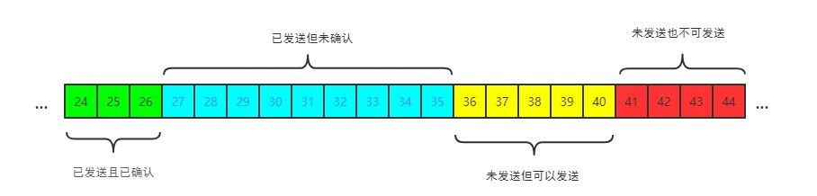
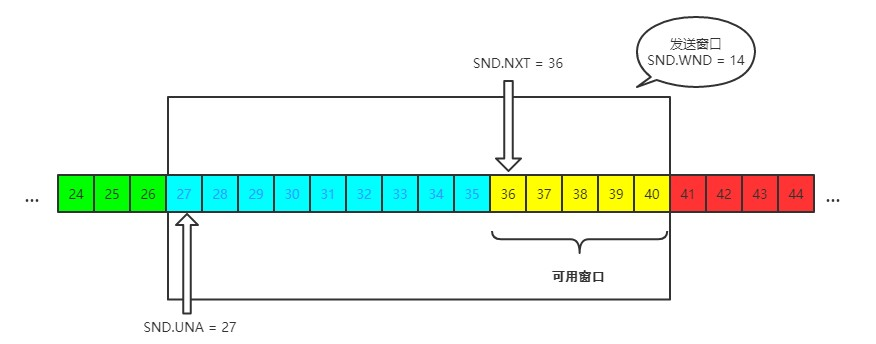
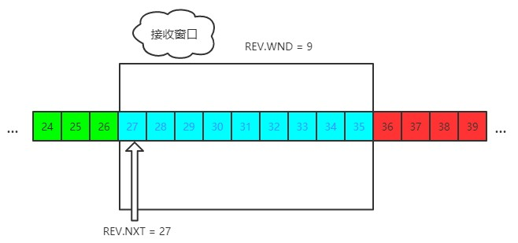

对于发送端和接收端而言，TCP 需要把发送的数据放到**发送缓存区**, 将接收的数据放到**接收缓存区**。

而流量控制索要做的事情，就是在通过接收缓存区的大小，控制发送端的发送。如果对方的接收缓存区满了，就不能再继续发送了。

要具体理解流量控制，首先需要了解**滑动窗口**的概念。

## TCP滑动窗口

TCP 滑动窗口分为两种: 发送窗口和接收窗口。

### 发送窗口

发送端的滑动窗口结构如下:

其中包含四大部分:

- 已发送且已确认
- 已发送但未确认
- 未发送但可以发送
- 未发送也不可以发送

其中有一些重要的概念，在下图中标注:

发送窗口就是图中被框住的范围。SND 即 `send`, WND 即 `window`, UNA 即 `unacknowledged`, 表示未被确认，NXT 即 `next`, 表示下一个发送的位置。

### 接收窗口

接收端的窗口结构如下:

REV 即 `receive`，NXT 表示下一个接收的位置，WND 表示接收窗口大小。

## 流量控制过程

这里不举太复杂的例子，以一个最简单的来回来模拟一下流量控制的过程，方便理解。

1. 首先双方三次握手，初始化各自的窗口大小，均为 200 个字节。
2. 假如当前发送端给接收端发送 100 个字节，那么此时对于发送端而言，SND.NXT 当然要右移 100 个字节，也就是说当前的 `可用窗口` 减少了 100 个字节，这很好理解。
3. 现在这 100 个到达了接收端，被放到接收端的缓冲队列中。不过此时由于大量负载的原因，接收端处理不了这么多字节，只能处理 40 个字节，剩下的 60 个字节被留在了 `缓冲队列` 中。
4. 注意了，此时接收端的情况是处理能力不够用啦，发送端给我少发点，所以此时接收端的接收窗口应该缩小，具体来说，缩小 60 个字节，由 200 个字节变成了 140 字节，因为缓冲队列还有 60 个字节没被应用拿走。
5. 因此，接收端会在 ACK 的报文首部带上缩小后的滑动窗口 140 字节，发送端对应地调整 `发送窗口` 的大小为 140 个字节。
6. 此时对于发送端而言，已经发送且确认的部分增加 40 字节，也就是 SND.UNA 右移 40 个字节，同时发送窗口缩小为 140 个字节。

这也就是流量控制的过程。尽管回合再多，整个控制的过程和原理是一样的。
